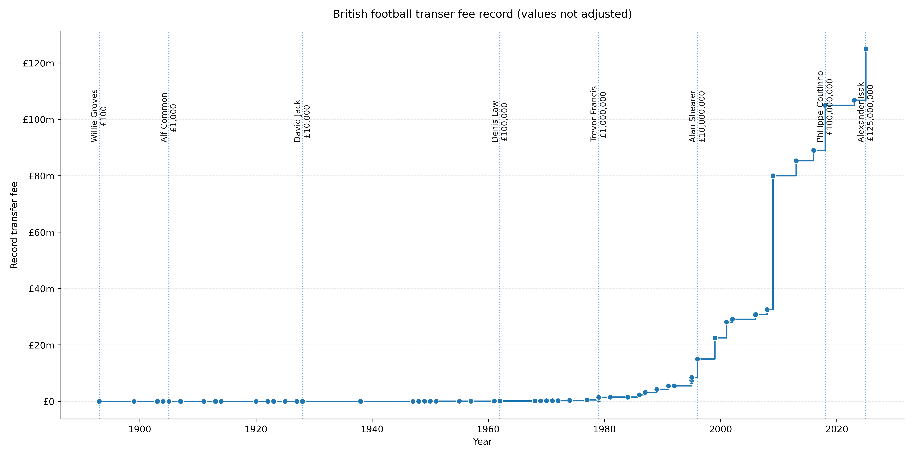

# Building a Feature Development Engine for Player Profiling

## Core Idea

Why did I choose to build this, and what did I hope to accomplish?

---

## Why did I want to do this

- The amount of money getting spent in football nowadays is ridiculous.  
- From Trevor Francis being the first “million pound man” in football with his 1979 transfer from Birmingham to Forest (though only £999,999 was paid by Brian Clough to avoid the label), prices on players have been increasing at an exponential rate.

- Whilst it looks like exponential growth, the truth is actually more interesting. You can track the history of football through the record transfer fees.
- 60s → gate entry  
- 79 → TV money *(need to check this)*  
- 96 → Premier League money  
- 01 → Champions League globalisation  
- 2010s → oil state money  
- 2018+ → sovereign wealth and financialisation  

- The graph is a staircase, showing a systematic reset of the financial ceiling of football.
- Realistically there is a finite limit on sovereign states that will be able to invest in football clubs.
- Very few clubs will be able to compete for the top value players.
- Less financially abundant clubs need to find ways to compete.
- Finding undervalued / overlooked talent.
- To do this we need to be able to drill down into what defines a player, both in your existing squads and what you’re looking to recruit.
- It needs to be easy to extend and develop against.
- It needs to output results in an understandable way — come back to the core principle that if no one can understand you, any analysis is wasted.
- Using StatsBomb data.

---

## Why Location Matters

- In event level data, events or actions can be characterised into different forms — passes, carries, shots, etc.
- But all passes are not created equal. All shots are not created equal.
- Location matters.
- A sideways pass between centre backs inside their own box has a different impact, intent and positional indicator than a sideways pass from a winger on the edge of the opponent’s area.
- Even though both would appear as passes in traditional datasets, they provide vastly different pieces of information on the players involved in them.
- The same action type can represent:
  - security  
  - pressure relief  
  - circulation  
  - progression  
  - chance creation  
  - desperation  
- Counting only the number of actions means we lose information on:
  - direction of play  
  - risk profile  
  - structural role of the player  
  - phase of possession  
- This can lead to players looking statistically similar whilst playing completely different styles of football.
- None of this is new — we see it week in, week out in the stands — but it’s about quantifying it in a way that models and quantitative methods can understand.

---

## Creating meaningful coordinate systems

- Statsbomb data, as with an overwhelling normal of data uses cartesian coordinates for their location (x,y) data
- x: 0->120
- y: 0->80
- Each team always attacks left to right, every match, every half every team
- Forward movement always increases `x`
- Defensive movement always decreases `x`
- Wide actions occur at low or high `y`
- Central actions occur near `y = 40`
- whilst this is useful for passing into models, its not how people talk about football
- Comes back to core philosophy that if people can't understand the analysis you're doing, its wasted
- Broke the coordinate system of the pitch down into areas that have meaning when talking about football

### Pitch Thirds
- Based off the idea that football is divided into thirds: defensice, midfield and attacking
- x < 40 - defensive
- 40 < x < 80 - midfield
- 80 < x - offensive (attacking)
- Allows to map build up play
- discover where a player opertates in relation to thier own goal
- players that are conservative v aggressive

### Pitch Thirds
- lateral organisation (wings vs central play)
- width usage
- wing vs interior tendencies
- flank overloads
- inverted roles
- full-back vs winger behaviour

### Positional Grid
- The thirds and channels are combined into a compact 3×3 positional grid:
- This layer allows us to:

- model positional identity  
- detect role drift between phases  
- compare players across teams and leagues  
- calculate spatial entropy and stability  
- track how possession and pressure flows through zones  

Instead of saying a player “plays right-back”, this layer lets us describe:

> a defender who primarily operates in the deep right half-space,  
> but regularly transitions into the advanced right channel.

This is the foundation for role fingerprinting and similarity modelling.

It answers:

> **What tactical spaces define this player’s identity?**

### Half-space lanes

Modern football is built around half-spaces — the vertical corridors between the wings and the central lane.

They are where:

- lines are broken  
- overloads are created  
- playmakers receive between defenders  
- cut-backs and low crosses originate  

This framework overlays half-space lanes to capture:

- interior vs wing behaviour  
- between-the-lines involvement  
- creative positioning  
- positional intelligence  

It lets us quantify whether a player:

- stays wide  
- drifts inside  
- lives between lines  
- or operates centrally  

It answers:

> **Does this player play in structured lanes, or in creative interior spaces?**

## 6. Depth Bands — Phase-of-Play Layer

Depth bands split the pitch into fine-grained vertical zones that correspond to phases of possession:

| Phase Band | Tactical Meaning |
|-----------|------------------|
| Deep Defence | First line of build-up |
| Build-up | Progression initiation |
| Midfield | Circulation and linking |
| Advanced Midfield | Chance creation |
| Final Third Lane | Finishing actions |

These bands allow the model to distinguish:

- early vs late involvement  
- initiators vs finishers  
- safe vs aggressive profiles  
- possession recyclers vs progression drivers  

It answers:

> **At what phase of play does this player primarily operate?**

## 7. Directional Vector Space — Decision Layer

Beyond where actions happen, we also model **how players choose to move the ball**.

Using movement vectors and angle buckets, we capture:

- forward vs lateral vs backward tendencies  
- predictability vs variability  
- structured vs chaotic behaviour  
- stylistic fingerprints  
- direction entropy  

This allows us to quantify:

- risk appetite  
- creativity  
- decision discipline  
- attacking intent  

Instead of describing a player as “progressive” or “safe”, this layer models *how often* and *how consistently* those choices are made.

It answers:

> **How does this player choose to move the ball?**
---

## Allowing for fair comparisons

*(you’ll expand this)*

---

## Aggregation lenses

Split data up in different types and aggregations:

### Totals
- How much did the player do  
- Raw volume over the data set (in this case the 2018 World Cup)  
- Used for responsibility, workload and involvement  
- Biased by minutes played  

### Per 90
- Totals normalised by the number of minutes played  
- Shows how effective they are at doing a particular action when they are on the pitch  
- Useful for comparing starters vs subs  
- Allows for a fairer comparison  

### Percentage split
- What proportion of their total of this type of action does each subtype take up  
- Good for finding style of play  
- How risky they like to be  

### Spatial distributions
- Where do they operate  
- Heatmap replacement  
- Structure modelling  

### Directional / Transitional distributions
- Movement / play development between different areas of the pitch  
- Progression modelling  
- Build-up responsibility  

### Statistical flavours
- Versatility  
- Chaos vs structure  
- Uniqueness of style  

---

## What this enables

- define the 

---

## How this will be used

